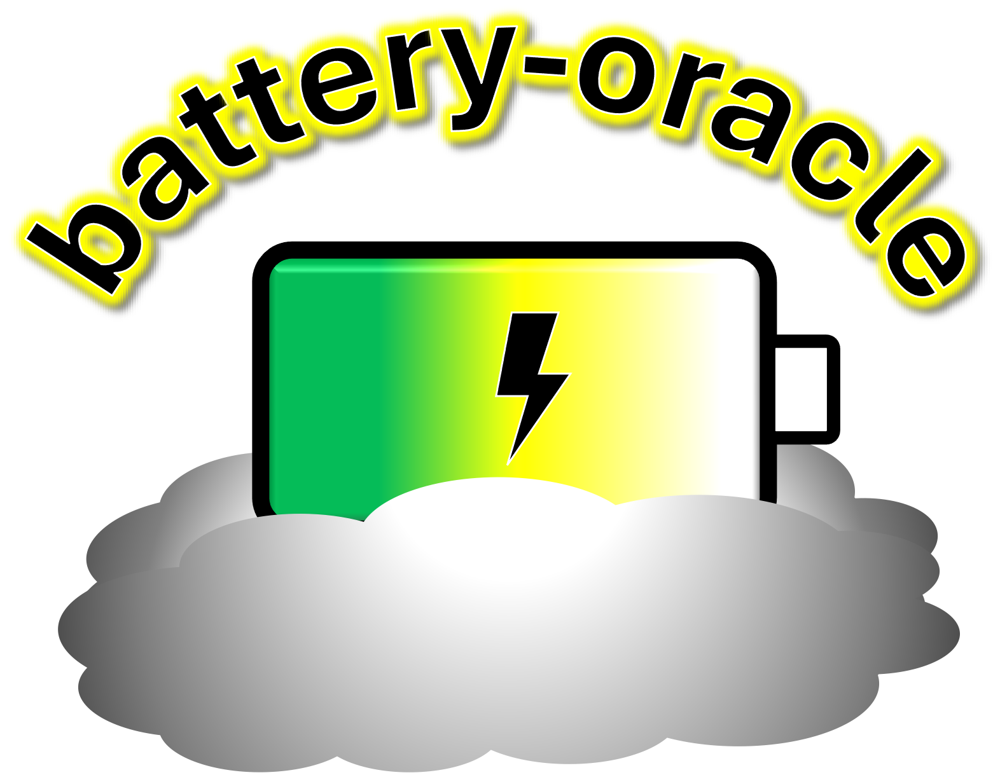

<p align="center">
  
</p>

# battery-oracle

[](https://github.com/TRustworthy-AI-Tools-for-Science/battery-oracle/actions/workflows/ci.yml)
[](https://trustworthy-ai-tools-for-science.github.io/battery-oracle/)
[](https://www.python.org/downloads/)
[](LICENSE)
[](https://www.pybamm.org/)
[](https://github.com/astral-sh/ruff)
[](https://github.com/TRustworthy-AI-Tools-for-Science/battery-oracle)

A standalone PyBaMM/SPMe battery oracle. Given a 6-D charge/discharge protocol
it runs a PyBaMM single-particle-with-electrolyte (SPMe) simulation, synthesises
an EIS spectrum, and fits an equivalent-circuit model (ECM). This mimics the same
kind of featurised state a real cell would, allowing the battery oracle to act as a
digital twin.

## Install

Managed with [uv](https://docs.astral.sh/uv/):

```bash
uv sync                          # core (PyBaMM + Randles-stub ECM)
uv sync --extra autoeis          # + Bayesian ECM fitting (AutoEIS)
uv sync --extra tune             # + Optuna calibration engine
uv sync --extra drt              # + DRT peaks (hybrid-drt)
```

or with pip:

```bash
pip install "battery-oracle[autoeis,tune] @ git+https://github.com/TRustworthy-AI-Tools-for-Science/battery-oracle.git"
```

### Extras

| Extra      | Enables                                                        | Without it                                   |
|------------|---------------------------------------------------------------|----------------------------------------------|
| `autoeis`  | Bayesian ECM fitting via AutoEIS                              | falls back to the fast analytic Randles stub |
| `drt`      | distribution-of-relaxation-times peaks (`hybrid-drt`)         | DRT peaks omitted                            |
| `tune`     | Optuna calibration engine (`battery_oracle.tune`)             | calibration unavailable                      |
| `rich`     | prettier logging handler                                      | plain stdlib logging                         |

## Usage

```python
from battery_oracle import PyBaMMOracle, make_pybamm_candidates

oracle = PyBaMMOracle(degradation_preset="accelerated")
oracle.reset()
for protocol in make_pybamm_candidates():      # 6-D protocol grid
    oracle(protocol)                           # runs SPMe → EIS → ECM
    print(oracle._history[-1]["end_soh"])
```

The ECM circuit is configurable (`PyBaMMOracle(circuit="R1-[R2,P3]-[R4,P5]", ...)`);
it defaults to `battery_oracle.DEFAULT_CIRCUIT`.

The reduced-order model is selectable with `model="SPMe"` (default), `"SPM"`, or
`"DFN"` — see the [model docs](https://trustworthy-ai-tools-for-science.github.io/battery-oracle/models.html)
and the [numerical-stability notes](https://trustworthy-ai-tools-for-science.github.io/battery-oracle/numerics.html).

## Experiments (from a YAML protocol)

`config_experiment_defaults.yml` defines an experiment protocol (model, cycling,
degradation, EIS, ECM, and one or more 6-D protocols) that the package can execute:

```python
from battery_oracle import run_experiment
history = run_experiment("config_experiment_defaults.yml")
```

## Documentation

Full docs (guides, API reference, and the SPM/SPMe/DFN + numerical-stability
notebooks) are published at
**<https://trustworthy-ai-tools-for-science.github.io/battery-oracle/>**.

## Calibration (tune-oracle)

The `[tune]` extra provides an Optuna Bayesian-optimisation engine that fits the
oracle's degradation hyperparameters (kinetics / SEI / dead-Li / plating scales)
to a real cell's measured EIS/capacity behaviour. It is dataset-agnostic: it
operates on a plain **cache dict** (measured ECM-per-cycle + capacity +
protocols) and precomputed real-target metrics.

```python
from battery_oracle import calibrate_oracle, write_oracle_config, compute_real_targets

targets = compute_real_targets(cache)
out = calibrate_oracle(cache, targets, preset="accelerated", n_trials=35)
write_oracle_config("config_oracle_mycell.yml", "mydataset", "accelerated",
                    cell_id="C01", n_cycles=len(cache["cycles"]),
                    best=out["best"], real_targets=targets, all_results=out["results"])
```

CLI (reads the cache/targets from JSON):

```bash
battery-oracle-tune --cache real_ecm.json --output-config config_oracle_mycell.yml \
    --preset accelerated --n-trials 35
```

Building the cache from a specific dataset (e.g. jones2022) is the caller's job;
see the `battery_forecast` jones2022 adapter for an example.

## License

MIT
